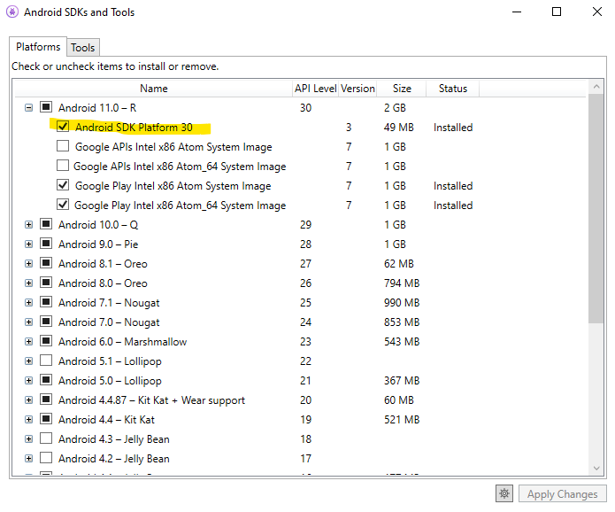

# msbuild-failed-repro

Repro of `Build failed. 0 Error(s)` in .NET 5 rc1 seen in a unit test [here](https://github.com/xamarin/xamarin-android/pull/5007).

To repro:

1. Install [.NET 5.0.100-rc.1.20426.3](https://dotnetcli.azureedge.net/dotnet/Sdk/5.0.100-rc.1.20426.3/dotnet-sdk-5.0.100-rc.1.20426.3-win-x64.exe).
2. You will need the Android SDK provided by the Xamarin workload in Visual Studio and `Android SDK Platform 30`.

Go to `Tools > Android > Android SDK Manager` in Visual Studio:

3. Clone this repo.
4. `dotnet build` in the top directory.

Results with:

    Build FAILED.
        0 Warning(s)
        0 Error(s)
